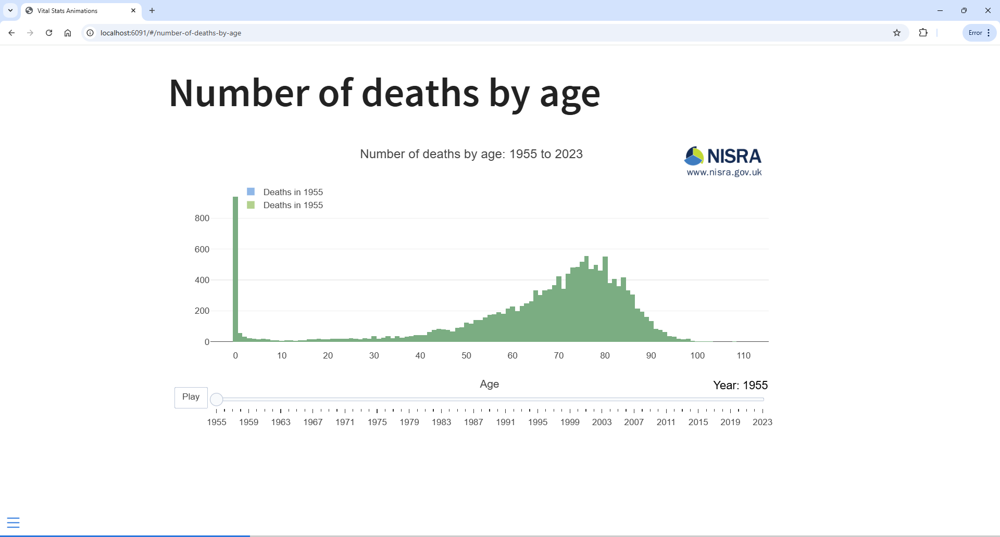
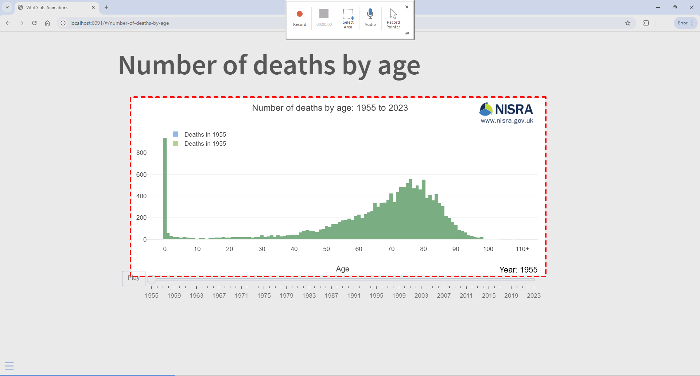
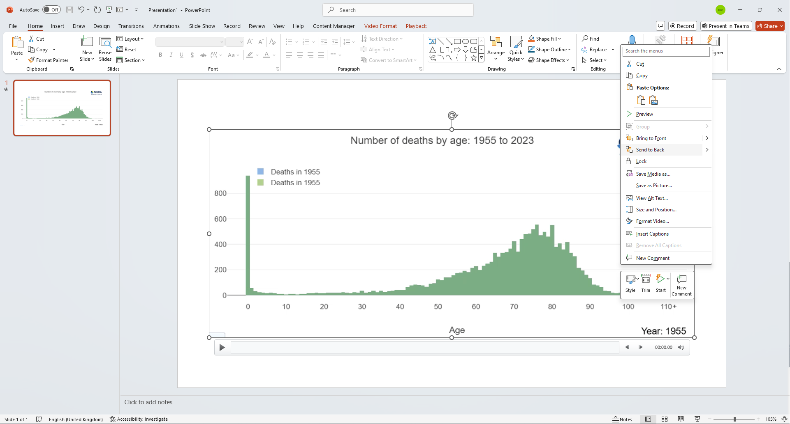

# Files

This repo contains two Quarto Markdown (.qmd) scripts that create sample animations:

1. __[vital-stats-animations.qmd](vital-stats-animations.qmd)__ - This imports data from local files (in this case Excel data from the project's data folder) and outputs some animations to a HTML slideshow.
2. __[data-portal-animations.qmd](data-portal-animations.qmd)__ - This imports data from the NISRA data portal and outputs some animations to a HTML slideshow.

To see either of these outputs open the script in RStudio and click the Render button.

# Capturing animations as mp4 videos

After rendering, in order to save one of these animations as an mp4 for posting on social media, navigate to the animation in your browser and maximise the window to ensure it all fits on one screen

Open MS PowerPoint and select __Blank Presentation__.

On the __Insert__ tab click the Screen Recording button

When the Screen Recording tools appear disable the __Audio__ and __Record Pointer__ options and use the __Select Area__ tool to draw a box around the chart you wish to record.

Press the __Record__ button on the screen record tools and a countdown from 3 will begin.

Once the countdown stops click the __Play__ button under the chart.

When the animation reaches the end Press <kbd>Win</kbd> + <kbd>Shift</kbd> + <kbd>Q</kbd> to stop the recording.

After the recording stops PowerPoint the video will be inserted onto the first slide of the presentation. Right click the video and choose __Save Media As__

