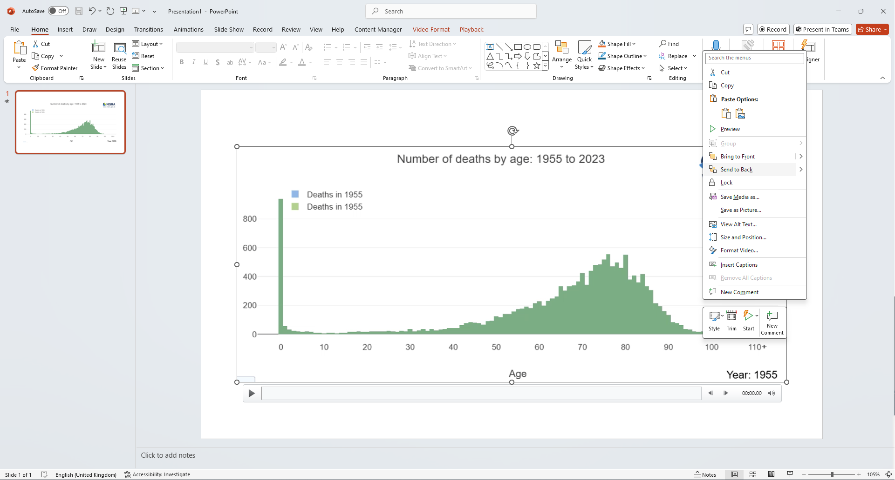

# Files

This repo contains two Quarto Markdown (.qmd) scripts that create sample animations:

1. __[vital-stats-animations.qmd](vital-stats-animations.qmd)__ - This imports data from local files (in this case Excel data from the project's data folder) and outputs some animations to a HTML slideshow.
2. __[data-portal-animations.qmd](data-portal-animations.qmd)__ - This imports data from the NISRA data portal and outputs some animations to a HTML slideshow.

To see either of these outputs open the script in RStudio and click the Render button.

More [information about Quarto Presentations can be found here](https://quarto.org/docs/presentations/revealjs/)

# Capturing animations as mp4 videos

After rendering, in order to save one of these animations as an mp4 for posting on social media, navigate to the animation in your browser and maximise the window to ensure it all fits on one screen


Open MS PowerPoint and select __Blank Presentation__.

On the __Insert__ tab click the Screen Recording button


When the Screen Recording tools appear disable the __Audio__ and __Record Pointer__ options and use the __Select Area__ tool to draw a box around the chart you wish to record.


Press the __Record__ button on the screen record tools and a countdown from 3 will begin.

Once the countdown stops click the __Play__ button under the chart.

When the animation reaches the end Press <kbd>Win</kbd> + <kbd>Shift</kbd> + <kbd>Q</kbd> to stop the recording.

After the recording stops PowerPoint the video will be inserted onto the first slide of the presentation. Right click the video and choose __Save Media As__



At this point you may want to perform further edits to the video such as trimming the start or end of the clip. This can be done using free software such as [Da Vinci Resolve](https://www.blackmagicdesign.com/products/davinciresolve).

# Editing chart types

All charts are created using [R's Plotly Library](https://plotly.com/r/).

Chart types and most other settings are set in the same manner as a non-animated plotly chart.

```
plot <- plot_ly(deaths,
    x = ~Age,
    y = ~deaths_year_1,
    frame = ~Year,
    type = "bar",
    marker = list(color = "#8fb7e7"),
    showlegend = TRUE,
    name = ~paste("Deaths in", min(Year)))
```

The addition of the `frame` variable (in our case for `Year`) renders the plot as an animated one.

Further examples of Plotly chart types (with accessibility concerns addressed) can be found in the demo of the [NISRA RAP Skeleton](https://github.com/NISRA-Tech-Lab/rap-skeleton).

More help with [animations in R plotly can be found here](https://plotly.com/r/animations/).

# Data from NISRA Data Portal

Some code has been included that reads in data from the [NISRA Data Portal](https://data.nisra.gov.uk)

The user created function `json_data_from_rpc()` is used to read the data into R by:

1. Go to the page for the relevant data on the Data Portal and select any filters you want to use. Then click View.


2. Scroll down to the __API Data Query Tab__, make sure the __JSON-RPC__ option is selected and copy the __Body__ of the Query to your clipboard


3. Paste this inside a call to 'json_data_from_rpc()` and assign it to something in your environment to begin working with the data in R.

```
mye_json <- json_data_from_rpc('
  {
  	"jsonrpc": "2.0",
  	"method": "PxStat.Data.Cube_API.ReadDataset",
  	"params": {
  		"class": "query",
  		"id": [
  			"Sex"
  		],
  		"dimension": {
  			"Sex": {
  				"category": {
  					"index": [
  						"All"
  					]
  				}
  			}
  		},
  		"extension": {
  			"pivot": null,
  			"codes": false,
  			"language": {
  				"code": "en"
  			},
  			"format": {
  				"type": "JSON-stat",
  				"version": "2.0"
  			},
  			"matrix": "MYE01T08"
  		},
  		"version": "2.0"
  	}
  }
')
```

Further code on how to reshape the data for plotting once it is read in can be found in the [data-portal-animations.qmd](data-portal-animations.qmd) script.
